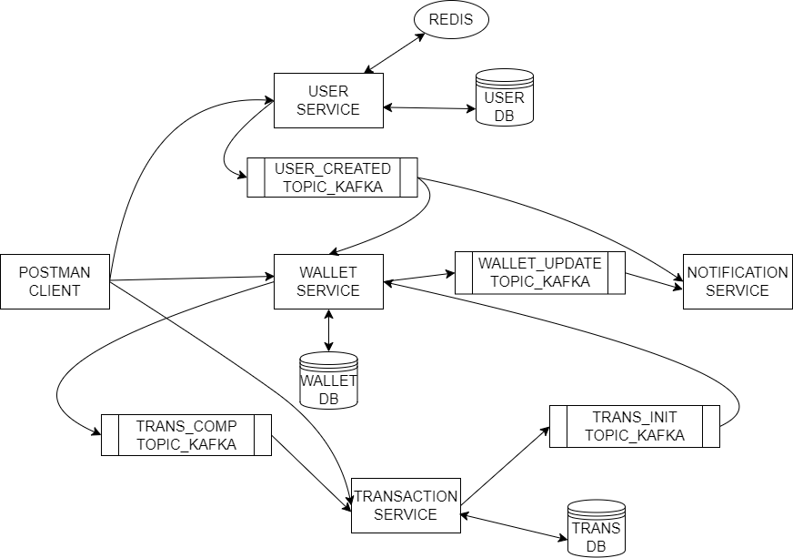

# Wallet Application

- It consists of the following microservices -
  - user-service
  - wallet-service
  - transaction-service
  - notification-service

## Project Setup

- clone the project on your local.
- Build the project from maven. (Usually in vscode you can probably do maven reload to get all the spring dependencies)
- In each microservice in `src/main/resources/application.properties` replace `password` with your actual password of MySQL in `spring.datasource.password=password`

## Run Project

- Run each microservice
- From the controller you can get the endpoints to hit.
